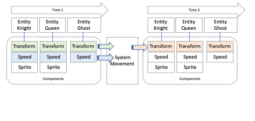
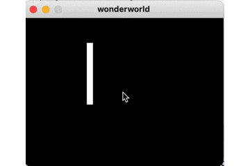
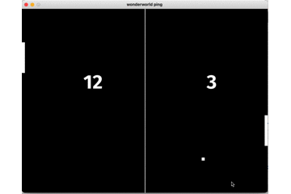

# wonderworld - Data-oriented Python Game Engine

<br><br><br><br><br><br>

* **Game Engine** implemented on **Database Engine (in memory with pandas)**
* **world** is a **database**
* **archetype** is a **table**
* **entity** is a **row(id)**
* **componenten** is one **column**
* **system** is a **function**
* **query** is a **database query**

*I have long wanted to program games in Pygame using the Entity Component System (ECS) game design pattern. Once when I looked at the Bevy game framework in Rust, I was hooked. I wanted something like that in Python too.
Since I couldn't find such a framework anywhere, I started developing a Python ECS framework myself -* **wonderworld**

## Entity Component System ECS

The data-oriented programming (DOP) approach tries to strictly separate data and program from each other.

One way to do this is with the **Entity Component System** (ECS) design pattern.

A **component** in the ECS design pattern contains only data.

Examples:

* Transform(x,y) - TransformComponent
* Speed (x,y) - SpeedComponent
* Sprite(image) - ImageComponent

A component does not contain any processing logic.

An **entity** is a game object, such as the knight. It consists of any number of components and does not itself contain any data or program logic. A unique ID linked to the components via an internal data structure is sufficient for the implementation of an entity.

A **system** contains the complete processing logic, but no own data. A game can consist of any number of systems. A system reads components and transforms their current state into another.

For example, the **Movement system** retrieves all speed components (SpeedComponents) and transform components (PositionComponent) in order to calculate the new position from them.

<br><br><br><br><br><br>

## Bevy

<br><br><br><br><br><br>

https://bevyengine.org

## pygame

<br><br><br><br><br><br>

https://www.pygame.org

## Example first.py

<br><br><br><br><br><br><br><br>


```python
%gui qt
from wonderworld import *

PADDLE_VELOCITY: float = 180.0

@dataclass
class Paddle(Component):
    pass


def setup():
    commands = get_commands()
    assets = get_resource(Assets)

    # asset_server = get_resource(AssetServer)
    # image_handle = asset_server.load("box.png");

    image_handle = assets.add(create_image(color=pygame.Color('white'),
                                           size=Vector2(10.0, 100.0)))

    # camera
    commands.spawn(Camera2dBundle(camera=Camera(),
                                  transform=Transform(translation=Vector2(0,0),
                                                      rotation=0,
                                                      scale=Vector2(0, 0))))

    # paddle
    commands.spawn(SpriteBundle(sprite=Sprite(image=image_handle),
                                transform=Transform(translation=Vector2(100, 100),
                                                    rotation=0,
                                                    scale=Vector2(0, 0)),
                                visibility=Visibility(True))) \
        .insert(Paddle())


def input():
    time = get_resource(Time)
    keyboard_input = get_resource(Keyboard)

    for transform, in Query(Transform, With(Paddle)):
        paddle_move = time.delta_seconds * PADDLE_VELOCITY
        if keyboard_input.pressed(K_UP):
            transform.translation.y = transform.translation.y - paddle_move

        if keyboard_input.pressed(K_DOWN):
            transform.translation.y = transform.translation.y + paddle_move


if __name__ == "__main__":
    App().insert_resource(ClearColor(pygame.Color('black'))) \
        .add_plugins(DefaultPlugins()) \
        .add_startup_system(setup) \
        .add_system(input) \
        .run()

```

    pygame 2.1.2 (SDL 2.0.18, Python 3.9.16)
    Hello from the pygame community. https://www.pygame.org/contribute.html


## Example ping.py

<br><br><br><br><br><br><br><br>


```python
%gui qt
from wonderworld import *

HEIGHT = 600
WIDTH = 800

PADDLE_WIDTH: float = 10.0
PADDLE_HEIGHT: float = 100.0
PADDLE_VELOCITY: float = 180.0
PADDLE_MAX_MOVE: float = HEIGHT - PADDLE_HEIGHT
PADDLE_MIN_MOVE: float = 0

BALL_WIDTH: float = 10.0
BALL_VELOCITY: Vector2 = Vector2(160.0, 160.0)

LINE_WIDTH: float = 2.0;


@dataclass
class Score(Resource):
    left: int
    right: int


@dataclass
class Ball(Component):
    pass


@dataclass
class Paddle(Component):
    up_key: int
    down_key: int


@dataclass
class Velocity(Component):
    value: Vector2


@dataclass
class LeftText(Component):
    pass


@dataclass
class RightText(Component):
    pass


def setup():
    commands = get_commands()
    assets = get_resource(Assets)

    # camera
    commands.spawn(Camera2dBundle(camera=Camera(),
                                  transform=Transform()))

    # ball
    ball_handle = assets.add(create_image(color=pygame.Color('white'),
                                          size=Vector2(BALL_WIDTH, BALL_WIDTH)))

    commands.spawn(SpriteBundle(sprite=Sprite(image=ball_handle),
                                transform=Transform(translation=Vector2(100, 100)),
                                visibility=Visibility(True))) \
        .insert(Velocity(BALL_VELOCITY.copy())) \
        .insert(Ball())

    # line
    line_handle = assets.add(create_image(color=pygame.Color('white'),
                                          size=Vector2(LINE_WIDTH, HEIGHT)))
    commands.spawn(SpriteBundle(sprite=Sprite(image=line_handle),
                                transform=Transform(translation=Vector2(WIDTH / 2, 0)),
                                visibility=Visibility(True)))
    # paddle_left
    left_handle = assets.add(create_image(color=pygame.Color('white'),
                                          size=Vector2(PADDLE_WIDTH, PADDLE_HEIGHT)))
    commands.spawn(SpriteBundle(sprite=Sprite(image=left_handle),
                                transform=Transform(translation=Vector2(0.0,
                                                                        HEIGHT / 2.0 - PADDLE_HEIGHT / 2)),
                                visibility=Visibility(True))) \
        .insert(Paddle(up_key=K_w, down_key=K_a))

    # paddle_right
    right_handle = assets.add(create_image(color=pygame.Color('white'),
                                           size=Vector2(PADDLE_WIDTH, PADDLE_HEIGHT)))
    commands.spawn(SpriteBundle(sprite=Sprite(image=right_handle),
                                transform=Transform(translation=Vector2(WIDTH - PADDLE_WIDTH,
                                                                        HEIGHT / 2.0 - PADDLE_HEIGHT / 2)),
                                visibility=Visibility(True))) \
        .insert(Paddle(up_key=K_UP, down_key=K_DOWN))

    # score
    asset_server = get_resource(AssetServer)
    font_size = 64
    commands.spawn(Text2dBundle(
        text =  Text(text="0",
                font =  asset_server.load("fonts/FiraSans-Bold.ttf",AssetType.FONT,size=font_size),
                font_size = font_size,
                color = Color('white')
            ),
        transform = Transform(translation=Vector2(WIDTH/4.0,200.)
    ))).insert(LeftText())
    commands.spawn(Text2dBundle(
        text=Text(text="0",
                  font=asset_server.load("fonts/FiraSans-Bold.ttf", AssetType.FONT, size=font_size),
                  font_size=font_size,
                  color=Color('white')
                  ),
        transform=Transform(translation=Vector2(3 *WIDTH / 4.0, 200.)
                            ))).insert(RightText())


def input():
    time = get_resource(Time)
    keyboard = get_resource(Keyboard)

    for (paddle, transform) in Query((Paddle, Transform)):
        paddle_move = time.delta_seconds * PADDLE_VELOCITY
        if keyboard.pressed(paddle.up_key):
            transform.translation.y = max(PADDLE_MIN_MOVE, transform.translation.y - paddle_move)
        if keyboard.pressed(paddle.down_key):
            transform.translation.y = min(PADDLE_MAX_MOVE, transform.translation.y + paddle_move)


def move_ball():
    time = get_resource(Time)
    for (transform, velocity) in Query((Transform, Velocity), With(Ball)):
        transform.translation += velocity.value * time.delta_seconds

        if transform.translation.y <= 0 or transform.translation.y + BALL_WIDTH >= HEIGHT:
            velocity.value.y = - velocity.value.y


def collides():
    for ball_transform, velocity in Query((Transform, Velocity), With(Ball)):
        ball_size = Vector2(BALL_WIDTH, BALL_WIDTH)
        for paddle_transform, in Query(Transform, With(Paddle)):
            paddle_size = Vector2(PADDLE_WIDTH, PADDLE_HEIGHT)
            if collide_aabb(ball_transform.translation, ball_size,
                            paddle_transform.translation, paddle_size):
                velocity.value.x = - velocity.value.x


def score():

    score = get_resource(Score)

    for transform, in Query(Transform,With(Ball)):
        if transform.translation.x < 0:
            score.right += 1
            transform.translation = Vector2(WIDTH/2,HEIGHT/2)
        elif transform.translation.x > WIDTH:
            score.left += 1
            transform.translation = Vector2(WIDTH/2,HEIGHT/2)

def show_score():
    score = get_resource(Score)

    for text, in Query(Text,With(LeftText)):
        text.text =  f"{score.left}"

    for text, in Query(Text,With(RightText)):
        text.text = f"{score.right}"

if __name__ == "__main__":
    App() \
        .insert_resource(ClearColor(pygame.Color('black'))) \
        .insert_resource(WindowDescriptor(
        title="wonderworld ping",
        width=WIDTH,
        height=HEIGHT,
        resizable=False)) \
        .insert_resource(Score(left=0, right=0)) \
        .add_plugins(DefaultPlugins()) \
        .add_startup_system(setup) \
        .add_system(input) \
        .add_system(move_ball) \
        .add_system(collides) \
        .add_system(score) \
        .add_system(show_score) \
        .run()
```

    pygame 2.1.2 (SDL 2.0.18, Python 3.9.16)
    Hello from the pygame community. https://www.pygame.org/contribute.html


```python

```

* Let's build an Entity Component System from scratch (part 1) https://devlog.hexops.com/2022/lets-build-ecs-part-1/
* Let's build an Entity Component System (part 2): databases https://devlog.hexops.com/2022/lets-build-ecs-part-2-databases/


```python

```
